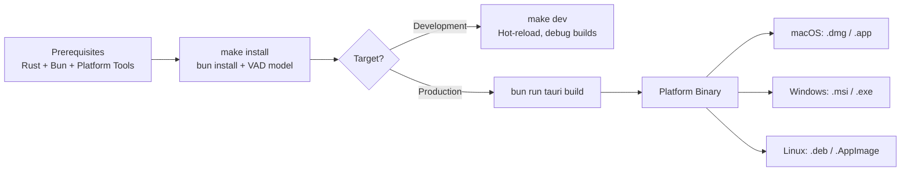

# Build Instructions

This guide covers how to set up the development environment and build Dictum from source across different platforms.

## Prerequisites

### All Platforms

- [Rust](https://rustup.rs/) (latest stable -- version pinned in `rust-toolchain.toml`)
- [Bun](https://bun.sh/) package manager
- [Tauri Prerequisites](https://tauri.app/start/prerequisites/)

### Platform-Specific Requirements

#### macOS

- Xcode Command Line Tools
- Install with: `xcode-select --install`

#### Windows

- Microsoft C++ Build Tools
- Visual Studio 2019/2022 with C++ development tools
- Or Visual Studio Build Tools 2019/2022

#### Linux

- Build essentials
- ALSA development libraries
- Install with:

  ```bash
  # Ubuntu/Debian
  sudo apt update
  sudo apt install build-essential libasound2-dev pkg-config libssl-dev libvulkan-dev vulkan-tools glslc libgtk-3-dev libwebkit2gtk-4.1-dev libayatana-appindicator3-dev librsvg2-dev libgtk-layer-shell0 libgtk-layer-shell-dev patchelf cmake

  # Fedora/RHEL
  sudo dnf groupinstall "Development Tools"
  sudo dnf install alsa-lib-devel pkgconf openssl-devel vulkan-devel \
    gtk3-devel webkit2gtk4.1-devel libappindicator-gtk3-devel librsvg2-devel \
    gtk-layer-shell gtk-layer-shell-devel \
    cmake

  # Arch Linux
  sudo pacman -S base-devel alsa-lib pkgconf openssl vulkan-devel \
    gtk3 webkit2gtk-4.1 libappindicator-gtk3 librsvg gtk-layer-shell \
    cmake
  ```

#### NixOS

A `flake.nix` is provided in the repository root. Enter the development shell with:

```bash
nix develop
```

## Setup

### 1. Clone the Repository

```bash
git clone git@github.com:cjpais/Handy.git
cd Handy
```

### 2. Install Dependencies

The Makefile handles both frontend dependencies and the required VAD model:

```bash
make install
```

This runs `bun install` and downloads `silero_vad_v4.onnx` into `src-tauri/resources/models/` if it is not already present.

Alternatively, install manually:

```bash
bun install
mkdir -p src-tauri/resources/models
curl -o src-tauri/resources/models/silero_vad_v4.onnx https://blob.handy.computer/silero_vad_v4.onnx
```

### 3. Start Development Server

```bash
make dev
```

Or directly:

```bash
bun run tauri dev
```

On macOS, if you encounter a cmake policy error:

```bash
CMAKE_POLICY_VERSION_MINIMUM=3.5 bun run tauri dev
```

## Build Pipeline



## Production Build

```bash
bun run tauri build
```

Output binaries are placed in `src-tauri/target/release/bundle/`:

| Platform | Format              | Location                                         |
|----------|---------------------|--------------------------------------------------|
| macOS    | `.dmg`, `.app`      | `src-tauri/target/release/bundle/dmg/`           |
| Windows  | `.msi`, `.exe`      | `src-tauri/target/release/bundle/msi/`           |
| Linux    | `.deb`, `.AppImage` | `src-tauri/target/release/bundle/deb/`, `appimage/` |

For code-signed builds, set the appropriate environment variables for your platform before running the build command. See the [Tauri signing docs](https://tauri.app/distribute/sign/) for details.

## Code Quality

```bash
make check          # Full check (cargo check + ESLint)
make check-fast     # Quick Rust syntax check only
make lint           # All linters (ESLint + clippy)
make lint-rust      # Clippy only
make lint-ts        # ESLint only
make format         # Auto-format all code (Prettier + cargo fmt)
make format-check   # Check formatting without changes
```

## Testing

```bash
# Frontend tests (Vitest + React Testing Library)
bun run test
bun run test:watch

# Rust tests
make test-rust
# or: cd src-tauri && cargo test

# All tests
make test

# E2E tests (Playwright)
bun run test:e2e
```

## Ollama Setup (for AI Features)

Active Listening, Ask AI, Knowledge Base (RAG), and the Suggestion Engine all require a local [Ollama](https://ollama.com/) instance.

### Install Ollama

```bash
# macOS / Linux
curl -fsSL https://ollama.com/install.sh | sh

# Or download from https://ollama.com/download
```

### Pull Recommended Models

```bash
# Chat model for Ask AI and Active Listening
ollama pull llama3.2

# Embedding model for RAG Knowledge Base
ollama pull nomic-embed-text
```

Ollama must be running (`ollama serve`) before using AI features. Dictum connects to `http://localhost:11434` by default.

## Makefile Reference

| Target             | Description                                  |
|--------------------|----------------------------------------------|
| `make install`     | Install all dependencies + VAD model         |
| `make dev`         | Run in development mode                      |
| `make build`       | Production build                             |
| `make check`       | Full check (Rust + TypeScript)               |
| `make check-fast`  | Quick Rust syntax check                      |
| `make check-lib`   | Check only Rust lib crate                    |
| `make lint`        | Run all linters                              |
| `make lint-rust`   | Run clippy                                   |
| `make lint-ts`     | Run ESLint                                   |
| `make format`      | Format all code                              |
| `make format-check`| Check formatting                             |
| `make test`        | Run all tests                                |
| `make test-rust`   | Run Rust tests                               |
| `make test-ts`     | Run frontend tests                           |
| `make build-rust`  | Build Rust backend only                      |
| `make build-frontend` | Build frontend only                       |
| `make generate-bindings` | Generate TypeScript bindings (tauri-specta) |
| `make clean`       | Clean all build artifacts                    |
| `make rebuild`     | Clean and rebuild                            |
| `make build-timings` | Show compilation timing report             |
| `make deps`        | Show dependency tree                         |
| `make help`        | Show all available targets                   |

## Troubleshooting

### cmake policy error (macOS)

If you see an error about cmake policy versions, prefix the command with the version override:

```bash
CMAKE_POLICY_VERSION_MINIMUM=3.5 bun run tauri dev
```

The `make dev` target applies this automatically.

### libgtk-layer-shell not found (Linux)

If the app fails to start with `error while loading shared libraries: libgtk-layer-shell.so.0`:

| Distro        | Install command                        |
|---------------|----------------------------------------|
| Ubuntu/Debian | `sudo apt install libgtk-layer-shell0` |
| Fedora/RHEL   | `sudo dnf install gtk-layer-shell`     |
| Arch Linux    | `sudo pacman -S gtk-layer-shell`       |

For building from source, also install the `-dev` package (e.g., `libgtk-layer-shell-dev` on Debian).

### Vulkan issues (Linux/Windows)

Ensure Vulkan drivers are installed for your GPU. On Linux:

```bash
# Verify Vulkan is available
vulkaninfo --summary
```

If Vulkan is not available, Whisper models fall back to CPU (OpenBLAS on Linux).

### WebKit rendering issues (Linux)

If the app window is blank or crashes on Linux:

```bash
WEBKIT_DISABLE_DMABUF_RENDERER=1 bun run tauri dev
```
