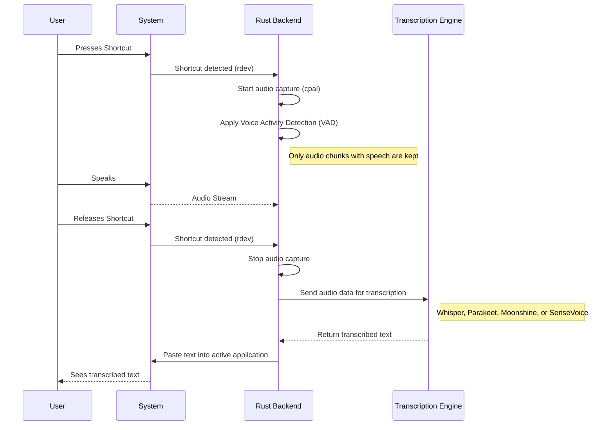
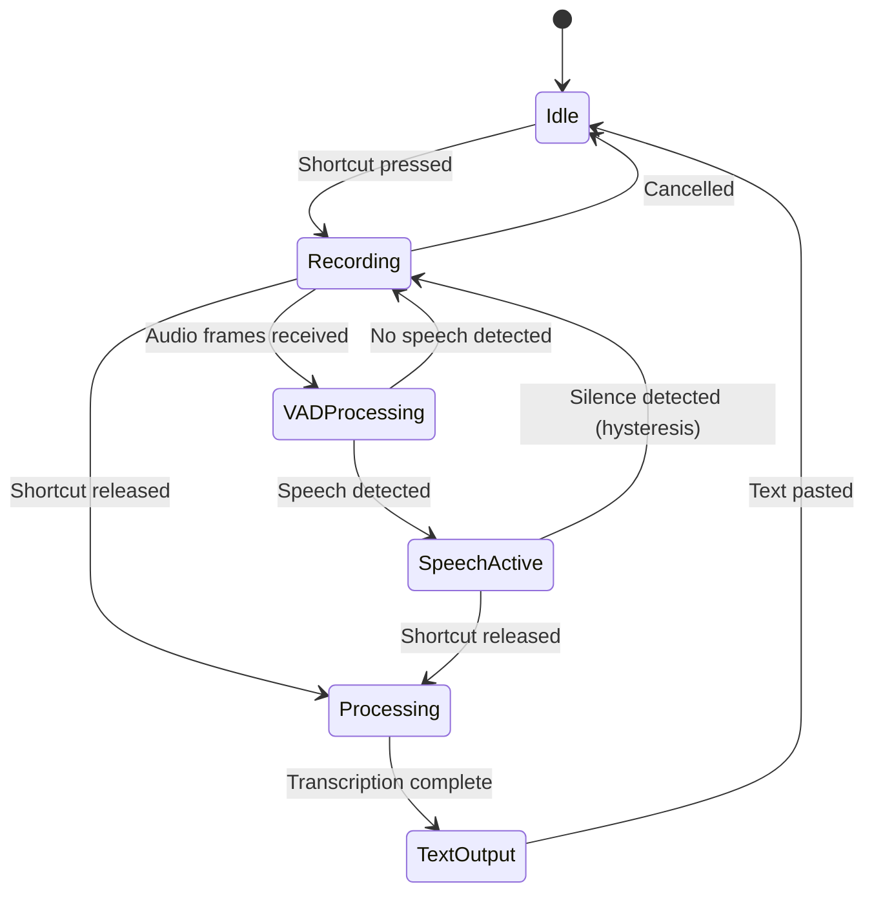
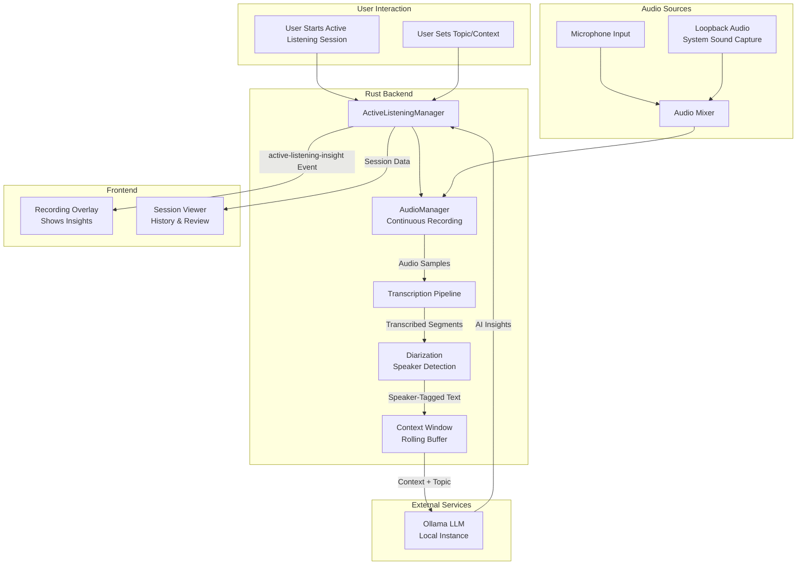
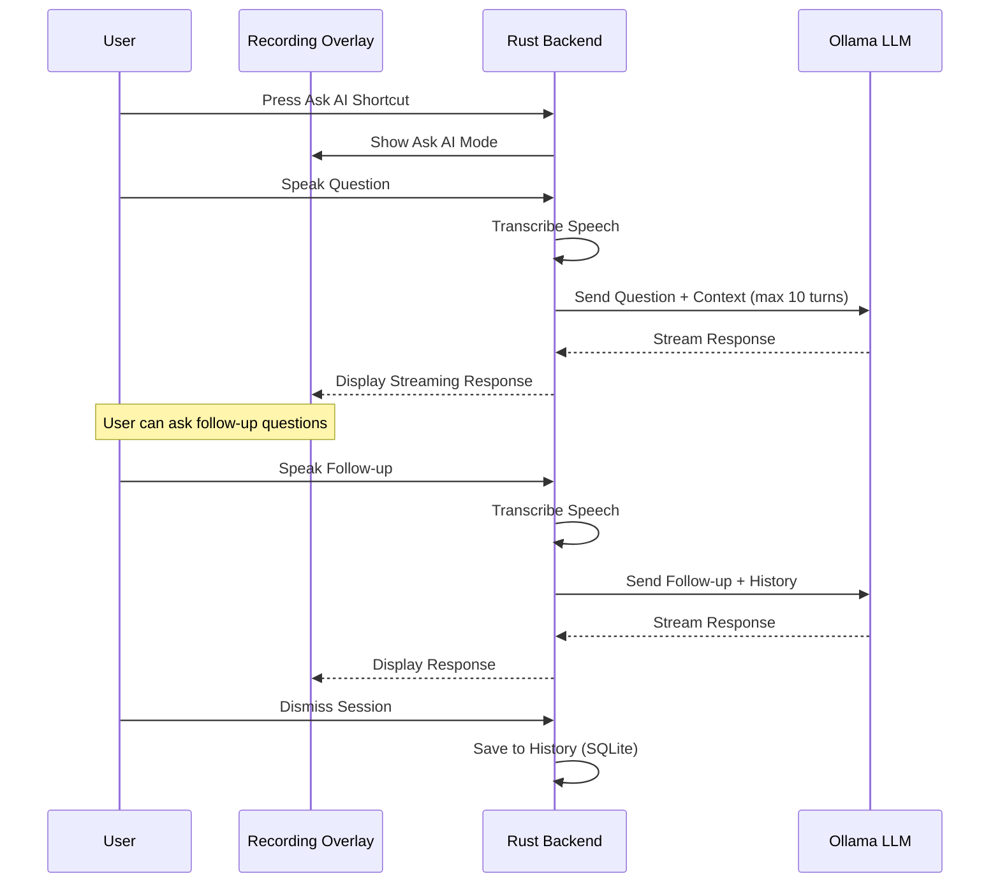
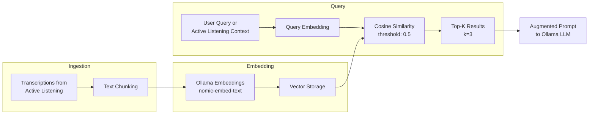
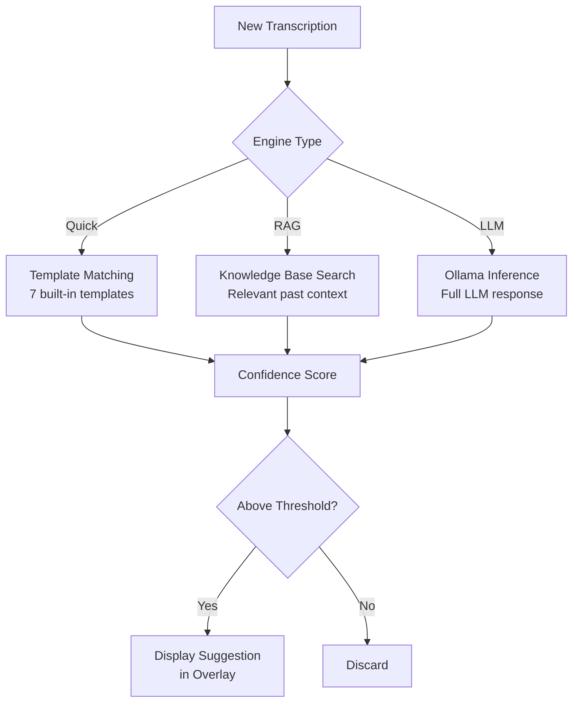
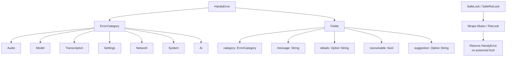
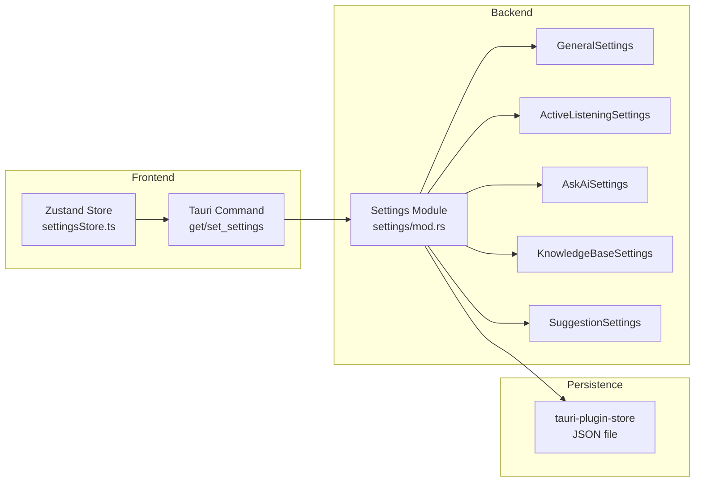
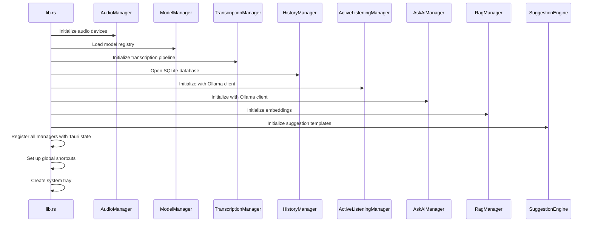

# Handy Developer Documentation

This document provides a guide for developers who want to understand, contribute to, or debug the Handy application.

## Project Overview

Handy is a free, open-source, and extensible speech-to-text application that works completely offline. It is a cross-platform desktop application built with Tauri (Rust + React/TypeScript) that provides simple, privacy-focused speech transcription. The user can press a shortcut, speak, and have their words appear in any text field -- all without sending their voice to the cloud.

Beyond core transcription, Handy integrates with a local Ollama instance to provide Active Listening (continuous transcription with AI insights), Ask AI (voice-based LLM conversations), a RAG Knowledge Base (semantic search over past transcriptions), and a Suggestion Engine (context-aware quick responses).

The goal of Handy is to be the most forkable speech-to-text app, providing a solid foundation for others to build upon.

## Architecture

Handy uses the [Tauri](https://tauri.app/) framework, which allows for building cross-platform desktop applications with a web-based frontend and a Rust backend.

- **Frontend**: The user interface is a web application built with [React](https://reactjs.org/) and [TypeScript](https://www.typescriptlang.org/). It is rendered in a webview. The frontend is responsible for the settings UI, onboarding, and displaying the recording status.
- **Backend**: The backend is a Rust application that handles all the heavy lifting, including:
  - Audio capture and processing (recording, loopback, mixing, resampling)
  - Voice Activity Detection (VAD)
  - Speech-to-text transcription using local models (Whisper, Parakeet, Moonshine, SenseVoice)
  - Speaker diarization via energy-based RMS analysis
  - Global keyboard shortcuts
  - LLM integration via Ollama for Active Listening, Ask AI, RAG, and Suggestions
  - System-level interactions (pasting text, tray icon, overlay)
  - Managing application state, settings, and error handling

Communication between the frontend and backend is handled through Tauri's command and event system, with type safety provided by [Specta](https://specta.dev/) and [tauri-specta](https://github.com/oscartbeaumont/tauri-specta).

## Visual Architecture

### High-Level Architecture

```mermaid
graph TD
    subgraph User Interaction
        A[User Presses Shortcut]
    end

    subgraph "Rust Backend (Tauri)"
        B[Global Shortcut Listener<br>rdev / Handy Keys]
        C[Audio Capture<br>cpal / loopback]
        D[VAD<br>vad-rs / Silero]
        E[Transcription<br>transcribe-rs<br>Whisper / Parakeet / Moonshine / SenseVoice]
        F[Text Output<br>enigo / wtype / dotool]
        O[Ollama Client]
    end

    subgraph "Frontend (React/TypeScript)"
        G[Settings UI]
        H[Recording Overlay]
    end

    I[Tauri Core]

    A --> B
    B -- "Toggle Recording" --> C
    C -- "Audio Stream" --> D
    D -- "Voice Chunks" --> E
    E -- "Transcribed Text" --> F
    F -- "Paste Text" --> A

    I -- "Commands & Events" -- G
    I -- "Commands & Events" -- H
    B -- "Events" --> I
    E -- "Active Listening" --> O
```

### Transcription Workflow



### Audio Pipeline State Machine



### Active Listening Architecture

Active Listening is an advanced feature that continuously transcribes audio and generates AI-powered insights using a local Ollama instance.



**Key Components:**

- **ActiveListeningManager** (`src-tauri/src/managers/active_listening.rs`): Orchestrates sessions, manages state, and coordinates between audio capture, transcription, and Ollama. Supports 7 built-in prompt templates for different use cases (meeting notes, key points, action items, etc.).
- **Context Window**: Maintains a rolling buffer of recent transcriptions to provide context for insight generation.
- **Diarization** (`src-tauri/src/audio_toolkit/diarization/`): Detects speaker changes via RMS energy analysis and silence gaps, tagging transcription segments with speaker labels.
- **Audio Sources**: Supports microphone input, system loopback audio capture, or a mix of both for comprehensive meeting capture.
- **Ollama Integration**: Sends prompts to a local Ollama instance for generating insights based on the conversation context and user-defined topic.

### Ask AI Workflow

Ask AI allows users to have voice-based conversations with a local LLM, with multi-turn context support.



**Key Components:**

- **AskAiManager** (`src-tauri/src/managers/ask_ai.rs`): Manages conversation state with a maximum of 10 context turns, handles streaming responses, and coordinates with Ollama.
- **AskAiHistoryManager** (`src-tauri/src/managers/ask_ai_history.rs`): Persists conversations to SQLite with turn ordering for later review and continuation.
- **Conversation History UI** (`src/components/settings/ask-ai/ConversationHistory.tsx`): Allows users to browse, search, and continue past conversations.

### RAG Knowledge Base Pipeline



**Key Components:**

- **RagManager** (`src-tauri/src/managers/rag.rs`): Manages document ingestion, chunking, embedding generation, and similarity search.
- **Embeddings**: Uses the `nomic-embed-text` model via Ollama to generate semantic embeddings of text chunks.
- **Auto-Indexing**: When enabled, automatically indexes transcriptions from Active Listening sessions into the knowledge base.
- **Query**: Retrieves the top 3 most relevant chunks filtered by a 0.5 similarity threshold, then augments LLM prompts with retrieved context.

### Suggestion Engine Pipeline



### Error Handling Hierarchy



### Settings Architecture



### Manager Initialization Sequence



## Technology Stack

### Rust

- **Where**: The entire backend is written in Rust (`src-tauri/src`).
- **Why**: Rust is chosen for its performance, memory safety, and excellent capabilities for system-level programming. This makes it ideal for handling tasks like audio processing, machine learning inference, and managing global keyboard shortcuts without the overhead of a garbage collector.
- **How**:
  - **Tauri**: The core of the application is the [Tauri framework](https://tauri.app/) (v2.x), which manages the windowing, webview, and communication between the frontend and backend.
  - **`transcribe-rs`**: A key Rust library that provides the speech-to-text functionality. It acts as a high-level API over different transcription backends (Whisper, Parakeet, Moonshine, SenseVoice).
  - **`whisper-rs-sys`**: Rust bindings to `whisper.cpp`, a C++ implementation of the OpenAI Whisper model.
  - **`cpal` and `rodio`**: Cross-platform audio input/output (I/O), with rodio providing audio playback for feedback sounds.
  - **`rdev`**: Global keyboard shortcut listening.
  - **`tokio`**: Asynchronous programming runtime for long-running tasks like transcription and LLM streaming.
  - **`reqwest`**: HTTP client for Ollama API communication (streaming LLM responses).
  - **`rusqlite`**: SQLite database for transcription history and Ask AI conversation persistence.

### Ollama

- **Where**: Active Listening, Ask AI, RAG Knowledge Base, and Suggestion Engine features.
- **Why**: Provides local LLM inference without requiring cloud APIs, maintaining Handy's privacy-first approach.
- **How**: The `ollama_client.rs` module communicates with a local Ollama instance via its HTTP API (`http://localhost:11434`). It supports streaming responses for real-time AI interaction. The RAG system uses Ollama's embedding endpoint with the `nomic-embed-text` model for semantic search.

### Swift

- **Where**: `src-tauri/swift/apple_intelligence.swift`. Conditionally compiled only on Apple Silicon (aarch64) macOS devices.
- **Why**: Swift provides direct access to the latest macOS APIs, specifically the `FoundationModels` framework for Apple Intelligence integration.
- **How**: The Swift code is compiled into a static library during the build process (see `src-tauri/build.rs`). The `#[_cdecl]` attribute exposes functions callable from Rust via FFI.

### C/C++

- **Where**: Used as a dependency, not handwritten source code.
- **Why**: To leverage existing high-performance libraries.
- **How**: The `whisper-rs-sys` crate compiles `whisper.cpp`, a highly optimized C++ implementation of OpenAI Whisper. The Rust code communicates with this through FFI.

### TypeScript and React

- **Where**: The entire frontend is located in the `src` directory.
- **Why**: React provides a powerful, component-based UI library. TypeScript adds static typing for better code quality.
- **How**:
  - **Vite**: Frontend build tool with Hot Module Replacement (HMR).
  - **Tauri API**: The frontend communicates with the Rust backend using `@tauri-apps/api` and auto-generated bindings via tauri-specta.
  - **Zustand**: State management for React.
  - **i18next**: Internationalization with 16 supported languages.
  - **Tailwind CSS**: Utility-first CSS framework for styling.

## Project Structure

```
src/                              # Frontend (React + TypeScript)
  components/
    settings/
      general/                    # General settings UI
      advanced/                   # Advanced settings
      models/                     # Model management
      history/                    # Transcription history
      active-listening/           # Active Listening settings and sessions
      ask-ai/                     # Ask AI settings and conversation history
      knowledge-base/             # RAG Knowledge Base configuration
      post-processing/            # LLM post-processing settings
      debug/                      # Debug mode UI
      about/                      # About page
      *.tsx                       # Individual setting components
    model-selector/               # Model download and selection
    onboarding/                   # First-run experience
  hooks/                          # Custom React hooks
  i18n/
    locales/                      # 16 language directories (ar, cs, de, en, ...)
    index.ts                      # i18n setup
    languages.ts                  # Language metadata
  lib/
    constants/                    # Application constants
    errors/                       # Frontend error handling
    utils/                        # Shared utilities
  overlay/                        # Recording overlay window
  stores/
    settingsStore.ts              # Zustand settings store
    modelStore.ts                 # Model state management
    errorStore.ts                 # Global error state
  bindings.ts                     # Auto-generated Tauri type bindings
  App.tsx                         # Main application component
  main.tsx                        # Frontend entry point
src-tauri/                        # Backend (Rust)
  src/
    lib.rs                        # Main entry point, Tauri setup
    main.rs                       # Binary entry point
    error.rs                      # HandyError and ErrorCategory
    ollama_client.rs              # Streaming Ollama LLM client
    llm_client.rs                 # LLM client abstraction
    actions.rs                    # Core transcription action orchestration
    input.rs                      # Cross-platform text input
    tray.rs                       # System tray management
    tray_i18n.rs                  # Tray menu translations
    overlay.rs                    # Recording overlay control
    clipboard.rs                  # Clipboard operations
    audio_feedback.rs             # Recording sound playback
    apple_intelligence.rs         # Apple Intelligence FFI
    signal_handle.rs              # SIGUSR2 signal handling
    commands/                     # Tauri command handlers
      mod.rs                      # Command registration
      audio.rs                    # Audio device commands
      models.rs                   # Model management commands
      transcription.rs            # Transcription commands
      history.rs                  # History commands
      active_listening.rs         # Active Listening commands
      ask_ai.rs                   # Ask AI commands
      rag.rs                      # RAG Knowledge Base commands
      suggestions.rs              # Suggestion Engine commands
    managers/                     # Core business logic
      mod.rs                      # Manager exports
      audio.rs                    # Audio recording and device management
      model.rs                    # Model downloading and management
      transcription.rs            # Speech-to-text pipeline
      history.rs                  # Transcription history (SQLite)
      active_listening.rs         # Continuous transcription with AI insights
      ask_ai.rs                   # Multi-turn voice LLM conversations
      ask_ai_history.rs           # Conversation persistence (SQLite)
      rag.rs                      # RAG knowledge base
      suggestion_engine.rs        # Context-aware suggestions
    audio_toolkit/                # Low-level audio processing
      mod.rs                      # Audio toolkit exports
      constants.rs                # Audio constants
      text.rs                     # Text processing utilities
      utils.rs                    # Audio utility functions
      audio/
        mod.rs                    # Audio module exports
        device.rs                 # Device enumeration
        recorder.rs               # Audio recording with VAD and visualization
        resampler.rs              # Audio resampling (rubato)
        loopback.rs               # System audio capture
        mixer.rs                  # Multi-source audio mixing
        visualizer.rs             # Audio visualization data
        utils.rs                  # Audio utilities
      vad/                        # Voice Activity Detection (Silero VAD)
      diarization/                # Speaker diarization (RMS energy-based)
      bin/                        # Audio binary utilities
    shortcut/                     # Global keyboard shortcuts
      mod.rs                      # Shortcut module exports
      handler.rs                  # Shortcut event handler
      tauri_impl.rs               # Tauri shortcut implementation
      handy_keys.rs               # Custom key definitions
    settings/                     # Application settings
      mod.rs                      # Settings exports and main struct
      general.rs                  # General settings (language, shortcuts, audio)
      active_listening.rs         # Active Listening settings
      ask_ai.rs                   # Ask AI settings
      knowledge_base.rs           # RAG Knowledge Base settings
      suggestions.rs              # Suggestion Engine settings
    utils/                        # Shared utilities
      mod.rs                      # Utility exports, cancel_current_operation
      lock.rs                     # SafeLock and SafeRwLock traits
    helpers/                      # Additional helper modules
  swift/                          # Swift code for Apple Intelligence
  resources/
    models.json                   # Model registry (Whisper, Parakeet, Moonshine)
    models/                       # Downloaded model files
  Cargo.toml                      # Rust dependencies
  tauri.conf.json                 # Tauri application configuration
e2e/                              # End-to-end tests
  playwright/                     # Playwright test specs
Makefile                          # Development automation (30+ targets)
package.json                      # Frontend dependencies and scripts
vitest.config.ts                  # Vitest test configuration
```

## Feature Deep-Dives

### Active Listening

Active Listening provides continuous, real-time transcription with AI-generated insights from a local Ollama instance.

**Session Lifecycle:**

1. User starts a session, optionally setting a topic and selecting an audio source (microphone, loopback, or both)
2. AudioManager begins continuous recording
3. Audio is transcribed in segments, optionally processed through diarization for speaker detection
4. Transcribed segments are accumulated in a rolling context window
5. Periodically, the context window is sent to Ollama with a selected prompt template
6. AI insights are streamed back and displayed in the recording overlay
7. When the session ends, a meeting summary can be generated from the full transcript

**Prompt System:** 7 built-in prompt templates cover common use cases such as meeting notes, key points, action items, question tracking, and topic summarization. Users can also define custom prompts.

**Audio Sources:** Supports microphone-only, system loopback-only (capturing computer audio), or a mix of both. Loopback capture is useful for transcribing audio from video calls or other applications.

### Ask AI

Ask AI enables voice-based conversations with a local LLM through Ollama.

**Multi-Turn Context:** Maintains up to 10 context turns (MAX_CONTEXT_TURNS) per conversation, providing the LLM with sufficient history to maintain coherent multi-turn dialogues.

**Streaming:** Responses stream token-by-token from Ollama, displayed in real-time in the recording overlay for a responsive experience.

**Conversation History:** All conversations are persisted to SQLite via AskAiHistoryManager with turn ordering, allowing users to browse, search, and continue past conversations from the settings UI.

### RAG Knowledge Base

The RAG (Retrieval-Augmented Generation) Knowledge Base provides semantic search over accumulated transcriptions.

**Document Chunking:** Transcriptions are split into manageable chunks for embedding generation.

**Embeddings:** Uses the `nomic-embed-text` model via Ollama to generate semantic vector embeddings. The system defaults to this model but can be configured to use other Ollama-compatible embedding models.

**Cosine Similarity:** Query embeddings are compared against stored document embeddings using cosine similarity, with a configurable threshold (default: 0.5) to filter out low-relevance results.

**Auto-Indexing:** When enabled, the knowledge base automatically indexes transcriptions from Active Listening sessions, building a searchable corpus of past conversations. This is opt-in (disabled by default) to respect user privacy.

**Active Listening Integration:** When `use_in_active_listening` is enabled, the RAG system augments Active Listening prompts with relevant past context, creating a form of long-term memory.

### Suggestion Engine

The Suggestion Engine provides context-aware quick responses and suggestions based on recent transcriptions.

**Engine Types:**

- **Quick (Template Matching):** 7 built-in response templates for common patterns, providing instant suggestions without LLM latency
- **RAG:** Searches the Knowledge Base for relevant past context to inform suggestions
- **LLM:** Uses Ollama for full LLM-powered suggestions when more nuanced responses are needed

**Confidence Scoring:** Each suggestion receives a confidence score. Only suggestions above the configured threshold are displayed to the user.

### Error Handling

Handy uses a structured error handling system centered around `HandyError`.

**HandyError Fields:**

- `category` (`ErrorCategory`): Categorizes the error (Audio, Model, Transcription, Settings, Network, System, Ai)
- `message` (`String`): User-friendly error message
- `details` (`Option<String>`): Technical details for debugging
- `recoverable` (`bool`): Whether the user can retry or the error is fatal
- `suggestion` (`Option<String>`): Actionable recovery suggestion

**SafeLock and SafeRwLock:** Traits that wrap `Mutex` and `RwLock` access to return `HandyError` instead of panicking on poisoned locks. All mutex access in managers should use these traits.

## Getting Started

To run the application in development mode:

1. **Install dependencies**:
   ```bash
   make install
   ```
2. **Run the development server**:
   ```bash
   make dev
   ```
   This starts the Vite development server for the frontend and builds and runs the Rust backend. The application window will open automatically.

## Debugging

### Frontend Debugging

Since the frontend is a web application, you can use standard browser developer tools.

1. Run the application in development mode (`make dev`).
2. Right-click anywhere in the application window and select "Inspect Element" to open the web inspector.
3. You can now use the inspector to examine the DOM, debug JavaScript, and inspect network requests.

### Backend Debugging (Rust)

Use a debugger to set breakpoints and inspect the state of the Rust backend. The recommended way is to use the **CodeLLDB** extension in Visual Studio Code.

1. **Install the CodeLLDB extension** in VS Code.
2. **Create a `launch.json` file** in the `.vscode` directory with the following configuration:

    ```json
    {
      "version": "0.2.0",
      "configurations": [
        {
          "name": "Debug Handy Backend",
          "type": "lldb",
          "request": "launch",
          "program": "${workspaceFolder}/src-tauri/target/debug/handy",
          "args": [],
          "cwd": "${workspaceFolder}",
          "sourceLanguages": ["rust"]
        }
      ]
    }
    ```

3. **Start the frontend development server first**:
    ```bash
    bun run dev
    ```
    Wait for the frontend to compile.
4. **Start the debugger in VS Code**:
    - Open the "Run and Debug" view (Ctrl+Shift+D).
    - Select "Debug Handy Backend" from the dropdown menu.
    - Press F5 to start debugging.

The debugger will attach to the Rust process, and you can now set breakpoints in your Rust code.

**Note**: The `make dev` command builds the debug version automatically. To build manually, run `cargo build` in the `src-tauri` directory.

### Debug Mode

Handy includes a built-in debug mode accessible via `Cmd+Shift+D` (macOS) or `Ctrl+Shift+D` (Windows/Linux). This provides diagnostic information about audio devices, model state, and transcription pipeline status.

## Progressive Documentation

This section provides a step-by-step guide to understanding the codebase by making small changes.

### 1. Change a piece of text in the UI

1. Open `src/App.tsx`.
2. Locate a text element in the `return` statement.
3. Change the text to something else.
4. Save the file. The frontend will hot-reload, and you should see the change immediately.

This demonstrates how the frontend code is structured and how easy it is to make UI changes.

### 2. Add a new Tauri command

1. **Backend (Rust)**:
    - Open `src-tauri/src/commands/` and create or edit a command file.
    - Create a new function with the `#[tauri::command]` and `#[specta::specta]` attributes:
      ```rust
      #[tauri::command]
      #[specta::specta]
      fn greet(name: &str) -> String {
        format!("Hello, {}!", name)
      }
      ```
    - Register the command in `src-tauri/src/commands/mod.rs`.

2. **Generate bindings**:
    ```bash
    make generate-bindings
    ```
    This updates `src/bindings.ts` with the new command's TypeScript types.

3. **Frontend (TypeScript)**:
    - Import the generated command from `@/bindings`:

      ```tsx
      import { commands } from "@/bindings";

      const result = await commands.greet("Developer");
      ```

4. **Run the app** (`make dev`) and test the new command.

This demonstrates the type-safe communication flow between the frontend and the backend via tauri-specta.

## Testing

Handy has a comprehensive test suite covering unit tests, component tests, and end-to-end tests.

### Running Tests

```bash
# Run all frontend tests (unit + component tests)
bun run test

# Run tests in watch mode during development
bun run test:watch

# Run tests with coverage report
bun run test -- --coverage

# Run E2E tests with Playwright
bun run test:e2e

# Run Rust tests
make test-rust

# Run all tests
make test
```

### Test Structure

```
src/
  components/
    **/*.test.tsx                  # Component tests
  stores/
    *.test.ts                     # Store tests
  test/
    setup.ts                      # Test setup and mocks
e2e/
  playwright/
    settings.spec.js              # Settings E2E tests
    active-listening.spec.js      # Active Listening E2E tests
    ask-ai.spec.js                # Ask AI E2E tests
src-tauri/
  src/
    managers/
      *.rs                        # Rust unit tests (inline)
```

### Frontend Testing

Frontend tests use [Vitest](https://vitest.dev/) and [React Testing Library](https://testing-library.com/react).

**Key patterns:**

1. **Mocking Tauri Commands**: All Tauri commands are mocked in `src/test/setup.ts`:

   ```typescript
   vi.mock('@/bindings', () => ({
     commands: {
       getSettings: vi.fn(() => Promise.resolve({ status: 'ok', data: mockSettings })),
       // ... other mocked commands
     }
   }));
   ```

2. **Component Testing Example**:

   ```typescript
   import { render, screen, waitFor } from '@testing-library/react';
   import userEvent from '@testing-library/user-event';
   import { MyComponent } from './MyComponent';

   describe('MyComponent', () => {
     it('renders correctly', async () => {
       render(<MyComponent />);
       await waitFor(() => {
         expect(screen.getByText('Expected Text')).toBeInTheDocument();
       });
     });
   });
   ```

3. **i18n in Tests**: Translation keys are displayed as-is in tests (not translated), so assert against keys like `'settings.title'` rather than translated text.

### E2E Testing

E2E tests use [Playwright](https://playwright.dev/).

**Important Note**: Full Tauri E2E testing requires `tauri-driver`. The current E2E tests verify UI components and navigation but may require mock backends for Tauri-specific functionality.

**Running E2E tests:**

```bash
# Install Playwright browsers (first time only)
npx playwright install

# Run E2E tests
bun run test:e2e

# Run with UI mode for debugging
npx playwright test --ui

# Run specific test file
npx playwright test e2e/playwright/settings.spec.js
```

### Rust Testing

Rust tests are written inline using the standard `#[cfg(test)]` pattern:

```rust
#[cfg(test)]
mod tests {
    use super::*;

    #[test]
    fn test_my_function() {
        let result = my_function();
        assert_eq!(result, expected_value);
    }

    #[tokio::test]
    async fn test_async_function() {
        let result = async_function().await;
        assert!(result.is_ok());
    }
}
```

Run Rust tests with:

```bash
make test-rust
# or: cd src-tauri && cargo test

# Run with output
cd src-tauri && cargo test -- --nocapture

# Run specific test
cd src-tauri && cargo test test_name
```

### Writing New Tests

**Guidelines:**

1. **Test behavior, not implementation**: Focus on what the component/function does, not how it does it.
2. **Use descriptive test names**: `it('should show error message when API fails')` is better than `it('test error')`.
3. **Arrange-Act-Assert**: Structure tests with clear setup, action, and verification phases.
4. **Mock external dependencies**: Tauri commands, network requests, and timers should be mocked.
5. **Test edge cases**: Empty states, loading states, error states, and boundary conditions.

This document should provide a good starting point for exploring the Handy codebase. For more detailed information, refer to the source code, [CLAUDE.md](CLAUDE.md) for architecture details, and the documentation of the libraries used.
