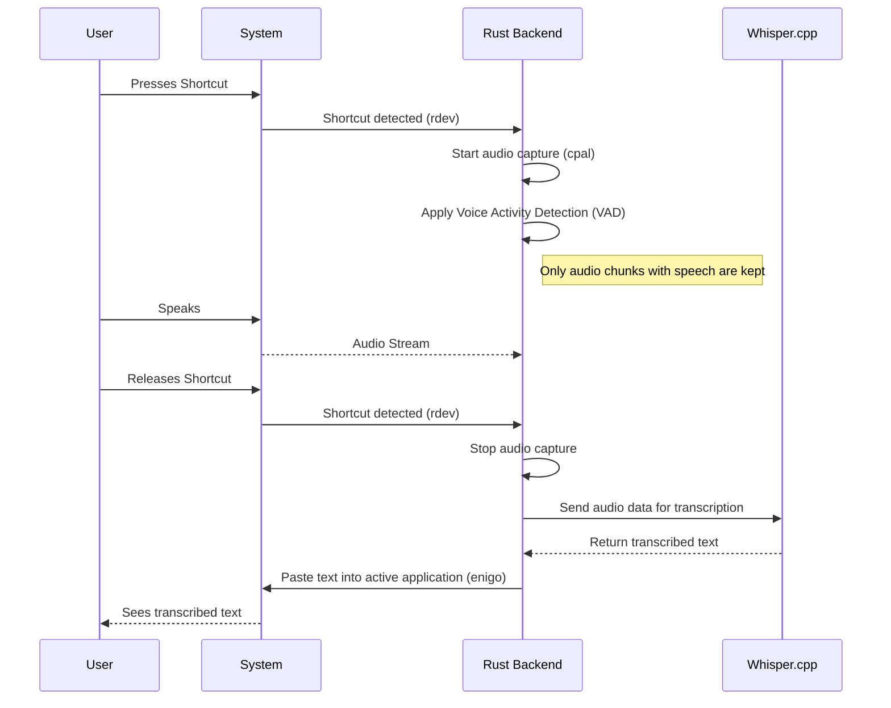
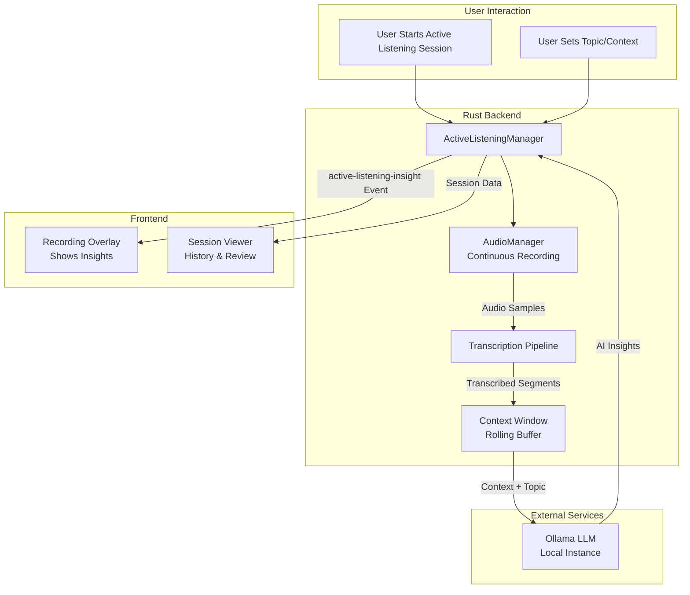
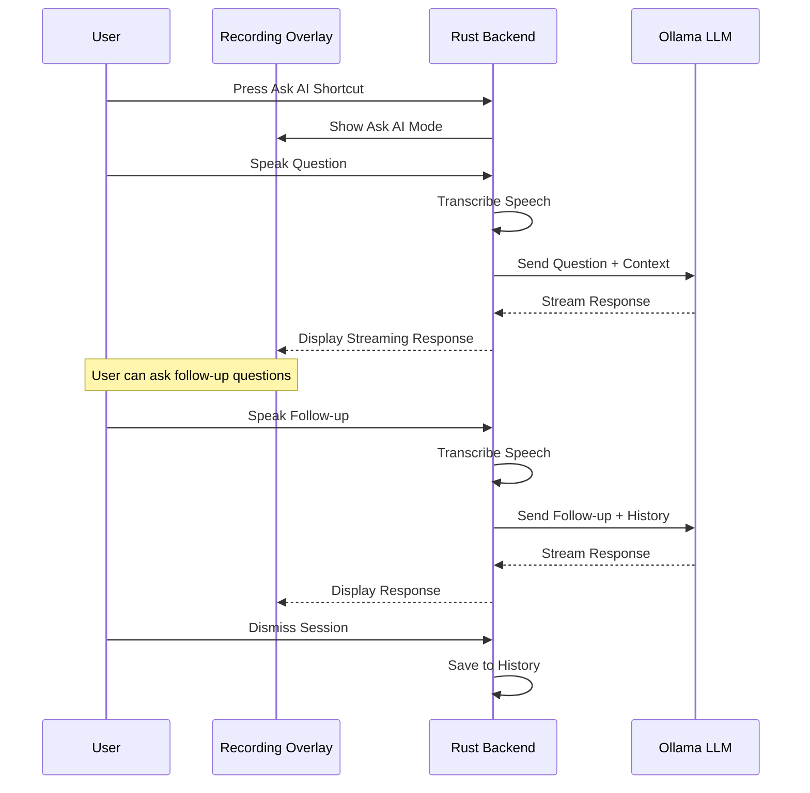
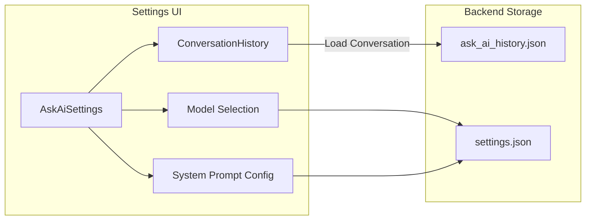

# Handy Developer Documentation

This document provides a guide for developers who want to understand, contribute to, or debug the Handy application.

## Project Overview

Handy is a free, open-source, and extensible speech-to-text application that works completely offline. It is a cross-platform desktop application built with Tauri (Rust + React/TypeScript) that provides simple, privacy-focused speech transcription. The user can press a shortcut, speak, and have their words appear in any text field—all without sending their voice to the cloud.

The goal of Handy is to be the most forkable speech-to-text app, providing a solid foundation for others to build upon.

## Architecture

Handy uses the [Tauri](https://tauri.app/) framework, which allows for building cross-platform desktop applications with a web-based frontend and a Rust backend.

- **Frontend**: The user interface is a web application built with [React](https://reactjs.org/) and [TypeScript](https://www.typescriptlang.org/). It is rendered in a webview. The frontend is responsible for the settings UI, onboarding, and displaying the recording status.
- **Backend**: The backend is a Rust application that handles all the heavy lifting, including:
  - Audio capture and processing
  - Voice Activity Detection (VAD)
  - Speech-to-text transcription using local models
  - Global keyboard shortcuts
  - System-level interactions (e.g., pasting text)
  - Managing application state and settings

Communication between the frontend and backend is handled through Tauri's command and event system, with type safety provided by [Specta](https://specta.dev/) and [tauri-specta](https://github.com/oscartbeaumont/tauri-specta).

## Visual Architecture

Here are a couple of diagrams to illustrate the architecture and workflows.

### High-Level Architecture

```mermaid
graph TD
    subgraph User Interaction
        A[User Presses Shortcut]
    end

    subgraph "Rust Backend (Tauri)"
        B[Global Shortcut Listener <br> (rdev)]
        C[Audio Capture <br> (cpal)]
        D[VAD <br> (vad-rs)]
        E[Transcription <br> (transcribe-rs / whisper.cpp)]
        F[Text Output <br> (enigo)]
    end

    subgraph "Frontend (React/TypeScript)"
        G[Settings UI]
        H[Recording Overlay]
    end

    I[Tauri Core]

    A --> B
    B -- "Toggle Recording" --> C
    C -- "Audio Stream" --> D
    D -- "Voice Chunks" --> E
    E -- "Transcribed Text" --> F
    F -- "Paste Text" --> A

    I -- "Commands & Events" -- G
    I -- "Commands & Events" -- H
    B -- "Events (e.g., RecordingStateChanged)" --> I
```

### Transcription Workflow



### Active Listening Architecture

Active Listening is an advanced feature that continuously transcribes audio and generates AI-powered insights using a local Ollama instance.



**Key Components:**

- **ActiveListeningManager** (`src-tauri/src/managers/active_listening.rs`): Orchestrates sessions, manages state, and coordinates between audio capture, transcription, and Ollama.
- **Context Window**: Maintains a rolling buffer of recent transcriptions to provide context for insight generation.
- **Ollama Integration**: Sends prompts to a local Ollama instance for generating insights based on the conversation context and user-defined topic.

### Ask AI Workflow

Ask AI allows users to have voice-based conversations with a local LLM, with multi-turn context support.



**Key Components:**

- **AskAiManager** (`src-tauri/src/managers/ask_ai.rs`): Manages conversation state, handles multi-turn context, and coordinates with Ollama.
- **AskAiHistoryManager** (`src-tauri/src/managers/ask_ai_history.rs`): Persists conversations for later review and continuation.
- **Conversation History UI** (`src/components/settings/ask-ai/ConversationHistory.tsx`): Allows users to browse, search, and continue past conversations.



## Technology Stack

This project uses a combination of technologies to deliver a cross-platform experience with high performance and a modern user interface.

### Rust

- **Where**: The entire backend is written in Rust (`src-tauri/src`).
- **Why**: Rust is chosen for its performance, memory safety, and excellent capabilities for system-level programming. This makes it ideal for handling tasks like audio processing, machine learning inference, and managing global keyboard shortcuts without the overhead of a garbage collector.
- **How**:
  - **Tauri**: The core of the application is the [Tauri framework](https://tauri.app/), which manages the windowing, webview, and communication between the frontend and backend.
  - **`transcribe-rs`**: This is a key Rust library that provides the speech-to-text functionality. It acts as a high-level API over different transcription backends.
  - **`whisper-rs-sys`**: This crate provides Rust bindings to `whisper.cpp`, a C++ implementation of the OpenAI Whisper model. This is a good example of how Rust can interface with existing C/C++ code.
  - **`cpal` and `rodio`**: These crates are used for cross-platform audio input/output (I/O).
  - **`rdev`**: This crate provides global keyboard shortcut listening.
  - **`tokio`**: Used for asynchronous programming, allowing the application to handle long-running tasks like transcription without blocking the UI.

### Swift

- **Where**: `src-tauri/swift/apple_intelligence.swift`. This code is conditionally compiled only on Apple Silicon (aarch64) macOS devices.
- **Why**: Swift is the native language for macOS and provides direct access to the latest operating system APIs. In this project, it's used to integrate with Apple's "Apple Intelligence" features, which are not yet available through a stable Rust API.
- **How**:
  - **Foreign Function Interface (FFI)**: The Swift code is compiled into a static library during the build process (see `src-tauri/build.rs`). The `#[_cdecl]` attribute in Swift exposes functions that can be called from Rust.
  - **`FoundationModels`**: The Swift code checks for and uses the `FoundationModels` framework to interact with the system's large language model for text processing. This is a forward-looking feature for an upcoming version of macOS.

### C/C++

- **Where**: The project does not contain any handwritten C/C++ source code directly. However, it is used as a dependency. The C/C++ source files are found in the `src-tauri/target/debug/build` directory during compilation.
- **Why**: To leverage existing high-performance libraries that are not available in Rust.
- **How**:
  - **`whisper.cpp`**: The `whisper-rs-sys` crate compiles `whisper.cpp`, a highly optimized C++ implementation of the OpenAI Whisper model. This allows Handy to perform fast and efficient speech recognition locally. The Rust code communicates with this C++ code through FFI.

### TypeScript & React

- **Where**: The entire frontend is located in the `src` directory.
- **Why**: React is a popular and powerful library for building user interfaces. TypeScript adds static typing to JavaScript, which helps to catch errors early and improve code quality and maintainability.
- **How**:
  - **Vite**: The frontend is built and served using [Vite](https://vitejs.dev/), which provides a fast development experience with Hot Module Replacement (HMR).
  - **Tauri API**: The frontend communicates with the Rust backend using the `@tauri-apps/api` package, which provides JavaScript functions to call Rust commands and listen for events.
  - **Zustand**: Used for state management in the React application.

## Project Structure

```
├── src/                      # Frontend (React + TypeScript)
│   ├── components/           # React components
│   ├── hooks/                # Custom React hooks
│   ├── i18n/                 # Internationalization
│   ├── lib/                  # Shared library code
│   ├── overlay/              # Recording overlay UI
│   ├── stores/               # Zustand state management stores
│   └── main.tsx              # Frontend entry point
├── src-tauri/                # Backend (Rust)
│   ├── src/
│   │   ├── main.rs           # Backend entry point
│   │   ├── commands/         # Tauri commands exposed to the frontend
│   │   ├── managers/         # Core logic managers (audio, transcription, etc.)
│   │   └── ...               # Other Rust modules
│   └── Cargo.toml            # Rust dependencies
├── package.json              # Frontend dependencies and scripts
└── tauri.conf.json           # Tauri application configuration
```

## Getting Started

To run the application in development mode, you need to have Node.js and Rust installed.

1.  **Install dependencies**:
    ```bash
    npm install
    ```
2.  **Run the development server**:
    `bash
npm run dev
`
    This command will start the Vite development server for the frontend and build and run the Rust backend. The application window will open automatically.

## Debugging

You can debug the frontend and backend separately.

### Frontend Debugging

Since the frontend is a web application, you can use the standard browser developer tools.

1.  Run the application in development mode (`npm run dev`).
2.  Right-click anywhere in the application window and select "Inspect Element" to open the web inspector.
3.  You can now use the inspector to examine the DOM, debug JavaScript, and inspect network requests.

### Backend Debugging (Rust)

You can use a debugger to set breakpoints and inspect the state of the Rust backend. The recommended way is to use the **CodeLLDB** extension in Visual Studio Code.

1.  **Install the CodeLLDB extension** in VS Code.
2.  **Create a `launch.json` file** in the `.vscode` directory with the following configuration:

    ```json
    {
      "version": "0.2.0",
      "configurations": [
        {
          "name": "Debug Handy Backend",
          "type": "lldb",
          "request": "launch",
          "program": "${workspaceFolder}/src-tauri/target/debug/handy",
          "args": [],
          "cwd": "${workspaceFolder}",
          "sourceLanguages": ["rust"]
        }
      ]
    }
    ```

3.  **Start the frontend development server first**:
    ```bash
    npm run dev
    ```
    Wait for the frontend to compile and the "Waiting for backend..." message to appear.
4.  **Start the debugger in VS Code**:
    - Open the "Run and Debug" view (Ctrl+Shift+D).
    - Select "Debug Handy Backend" from the dropdown menu.
    - Press F5 to start debugging.

The debugger will attach to the Rust process, and you can now set breakpoints in your Rust code.

**Note**: You need to build the debug version of the backend first. The `npm run dev` command does this automatically. If you want to build it manually, run `cargo build` in the `src-tauri` directory.

## Progressive Documentation

This section provides a step-by-step guide to understanding the codebase by making small changes.

### 1. Change a piece of text in the UI

Let's start by changing the title of the main window.

1.  Open `src/App.tsx`.
2.  Locate the `<h1>` tag in the `return` statement.
3.  Change the text inside the `<h1>` tag to something else.
4.  Save the file. The frontend will hot-reload, and you should see the change immediately.

This demonstrates how the frontend code is structured and how easy it is to make UI changes.

### 2. Add a new Tauri command

Now, let's add a new command in the backend and call it from the frontend.

1.  **Backend (Rust)**:
    - Open `src-tauri/src/main.rs`.
    - Create a new function with the `#[tauri::command]` attribute:
      ```rust
      #[tauri::command]
      fn greet(name: &str) -> String {
        format!("Hello, {}!", name)
      }
      ```
    - Add the new command to the `.invoke_handler()` in the `main` function:
      ```rust
      .invoke_handler(tauri::generate_handler![
          // ... existing commands
          greet
      ])
      ```

2.  **Frontend (TypeScript)**:
    - Open `src/App.tsx`.
    - Import the `invoke` function from `@tauri-apps/api`.
    - Add a button and a state to display the greeting:

      ```tsx
      import { invoke } from "@tauri-apps/api/core";
      import { useState } from "react";

      function App() {
        const [greeting, setGreeting] = useState("");

        const callGreetCommand = async () => {
          const result: string = await invoke("greet", { name: "Developer" });
          setGreeting(result);
        };

        return (
          <div>
            {/* ... existing UI ... */}
            <button onClick={callGreetCommand}>Greet</button>
            <p>{greeting}</p>
          </div>
        );
      }
      ```

3.  **Run the app** (`npm run dev`) and click the "Greet" button. You should see "Hello, Developer!" displayed.

This demonstrates the basic communication flow between the frontend and the backend.

## Testing

Handy has a comprehensive test suite covering unit tests, component tests, and end-to-end tests.

### Running Tests

```bash
# Run all frontend tests (unit + component tests)
bun run test

# Run tests in watch mode during development
bun run test:watch

# Run tests with coverage report
bun run test -- --coverage

# Run E2E tests with Playwright
bun run test:e2e

# Run Rust tests
cd src-tauri && cargo test
```

### Test Structure

```
├── src/
│   ├── components/
│   │   └── **/*.test.tsx      # Component tests
│   ├── stores/
│   │   └── *.test.ts          # Store tests
│   └── test/
│       └── setup.ts           # Test setup and mocks
├── e2e/
│   └── playwright/
│       ├── settings.spec.js   # Settings E2E tests
│       ├── active-listening.spec.js
│       └── ask-ai.spec.js
└── src-tauri/
    └── src/
        └── managers/
            └── *.rs           # Rust unit tests (inline)
```

### Frontend Testing

Frontend tests use [Vitest](https://vitest.dev/) and [React Testing Library](https://testing-library.com/react).

**Key patterns:**

1. **Mocking Tauri Commands**: All Tauri commands are mocked in `src/test/setup.ts`:

   ```typescript
   vi.mock('@/bindings', () => ({
     commands: {
       getSettings: vi.fn(() => Promise.resolve({ status: 'ok', data: mockSettings })),
       // ... other mocked commands
     }
   }));
   ```

2. **Component Testing Example**:

   ```typescript
   import { render, screen, waitFor } from '@testing-library/react';
   import userEvent from '@testing-library/user-event';
   import { MyComponent } from './MyComponent';

   describe('MyComponent', () => {
     it('renders correctly', async () => {
       render(<MyComponent />);
       await waitFor(() => {
         expect(screen.getByText('Expected Text')).toBeInTheDocument();
       });
     });
   });
   ```

3. **i18n in Tests**: Translation keys are displayed as-is in tests (not translated), so assert against keys like `'settings.title'` rather than translated text.

### E2E Testing

E2E tests use [Playwright](https://playwright.dev/).

**Important Note**: Full Tauri E2E testing requires `tauri-driver`. The current E2E tests verify UI components and navigation but may require mock backends for Tauri-specific functionality.

**Running E2E tests:**

```bash
# Install Playwright browsers (first time only)
npx playwright install

# Run E2E tests
bun run test:e2e

# Run with UI mode for debugging
npx playwright test --ui

# Run specific test file
npx playwright test e2e/playwright/settings.spec.js
```

### Rust Testing

Rust tests are written inline using the standard `#[cfg(test)]` pattern:

```rust
#[cfg(test)]
mod tests {
    use super::*;

    #[test]
    fn test_my_function() {
        let result = my_function();
        assert_eq!(result, expected_value);
    }

    #[tokio::test]
    async fn test_async_function() {
        let result = async_function().await;
        assert!(result.is_ok());
    }
}
```

Run Rust tests with:

```bash
cd src-tauri
cargo test

# Run with output
cargo test -- --nocapture

# Run specific test
cargo test test_name
```

### Writing New Tests

**Guidelines:**

1. **Test behavior, not implementation**: Focus on what the component/function does, not how it does it.
2. **Use descriptive test names**: `it('should show error message when API fails')` is better than `it('test error')`.
3. **Arrange-Act-Assert**: Structure tests with clear setup, action, and verification phases.
4. **Mock external dependencies**: Tauri commands, network requests, and timers should be mocked.
5. **Test edge cases**: Empty states, loading states, error states, and boundary conditions.

This document should provide a good starting point for exploring the Handy codebase. For more detailed information, please refer to the source code and the documentation of the libraries used.
