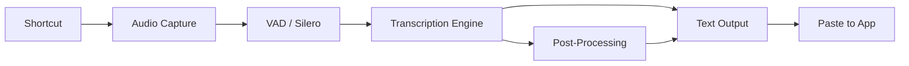

# Dictum

[](https://discord.com/invite/WVBeWsNXK4)

**A free, open source, and extensible speech-to-text application that works completely offline.**

Dictum is a cross-platform desktop application built with Tauri (Rust + React/TypeScript) that provides simple, privacy-focused speech transcription. Press a shortcut, speak, and have your words appear in any text field -- all without sending your voice to the cloud.

## Why Dictum?

Dictum was created to fill the gap for a truly open source, extensible speech-to-text tool. As stated on [handy.computer](https://handy.computer):

- **Free**: Accessibility tooling belongs in everyone's hands, not behind a paywall
- **Open Source**: Together we can build further. Extend Dictum for yourself and contribute to something bigger
- **Private**: Your voice stays on your computer. Get transcriptions without sending audio to the cloud
- **Simple**: One tool, one job. Transcribe what you say and put it into a text box

Dictum isn't trying to be the best speech-to-text app -- it's trying to be the most forkable one.

## Features

**Core Transcription:**
- Press a configurable keyboard shortcut to start/stop recording (or use push-to-talk mode)
- Voice Activity Detection (VAD) with Silero filters silence automatically
- Transcribed text is pasted directly into whatever application you're using
- Support for four transcription engines: Whisper, Parakeet, Moonshine, and SenseVoice
- Speaker diarization for multi-speaker transcription
- Custom word correction with n-gram matching

**AI Features (via local Ollama):**
- **Active Listening** -- continuous transcription with real-time AI-generated insights, meeting summaries, and speaker detection
- **Ask AI** -- voice-based multi-turn conversations with a local LLM
- **Knowledge Base (RAG)** -- semantic search over past transcriptions using vector embeddings
- **Suggestion Engine** -- context-aware quick responses via templates, RAG, or LLM

**Post-Processing:**
- LLM-powered transcript enhancement and formatting
- Apple Intelligence integration on macOS (Apple Silicon)

**General:**
- Transcription history with search and review
- Recording overlay with real-time visualization
- System tray integration with recording state indicators
- Internationalization: 16 languages (Arabic, Chinese, Czech, English, French, German, Italian, Japanese, Korean, Polish, Portuguese, Russian, Spanish, Turkish, Ukrainian, Vietnamese)
- Debug mode for diagnostics (`Cmd/Ctrl+Shift+D`)

## How It Works

1. **Press** a configurable keyboard shortcut to start/stop recording (or use push-to-talk mode)
2. **Speak** your words while the shortcut is active
3. **Release** and Dictum processes your speech using your selected transcription engine
4. **Get** your transcribed text pasted directly into whatever app you're using

The process is entirely local:

- Silence is filtered using VAD (Voice Activity Detection) with Silero
- Transcription uses your choice of model and engine
- Works on Windows, macOS, and Linux



## Available Models

| Model | Engine | Size | Speed | Accuracy | Notes |
|-------|--------|------|-------|----------|-------|
| Whisper Small | Whisper | 487 MB | Fast | Good | GPU-accelerated |
| Whisper Medium | Whisper | 492 MB | Medium | Better | Quantized (q4_1) |
| Whisper Turbo | Whisper | 1600 MB | Medium | High | GPU-accelerated |
| Whisper Large | Whisper | 1100 MB | Slow | Highest | Quantized (q5_0) |
| Parakeet V2 | Parakeet | 473 MB | Fast | Highest | English only, CPU-optimized |
| Parakeet V3 | Parakeet | 478 MB | Fast | High | Auto language detection, CPU-optimized |
| Moonshine Base | Moonshine | 58 MB | Very fast | Good | English only, handles accents well |

Dictum also supports SenseVoice and custom Whisper GGML models placed in the models directory.

## Quick Start

### Installation

1. Download the latest release from the [releases page](https://github.com/cjpais/Handy/releases) or the [website](https://handy.computer)
   - **macOS**: Also available via [Homebrew cask](https://formulae.brew.sh/cask/handy): `brew install --cask handy`
2. Install the application
3. Launch Dictum and grant necessary system permissions (microphone, accessibility)
4. Configure your preferred keyboard shortcuts in Settings
5. Start transcribing!

### Development Setup

For detailed build instructions including platform-specific requirements, see [BUILD.md](BUILD.md).

## Architecture

Dictum is built as a Tauri application combining:

- **Frontend**: React + TypeScript with Tailwind CSS for the settings UI
- **Backend**: Rust for system integration, audio processing, and ML inference
- **Core Libraries**:
  - `transcribe-rs`: Multi-engine speech recognition (Whisper, Parakeet, Moonshine, SenseVoice)
  - `whisper-rs`: Local Whisper inference with GPU acceleration
  - `cpal` + `rodio`: Cross-platform audio I/O and playback
  - `vad-rs`: Voice Activity Detection
  - `rdev`: Global keyboard shortcuts and system events
  - `rubato`: Audio resampling
  - `ollama_client`: Local LLM integration for AI features
  - `rusqlite`: Transcription history and conversation persistence

### Debug Mode

Dictum includes an advanced debug mode for development and troubleshooting. Access it by pressing:

- **macOS**: `Cmd+Shift+D`
- **Windows/Linux**: `Ctrl+Shift+D`

## Known Issues and Current Limitations

This project is actively being developed and has some [known issues](https://github.com/cjpais/Handy/issues). We believe in transparency about the current state:

### Major Issues (Help Wanted)

**Whisper Model Crashes:**

- Whisper models crash on certain system configurations (Windows and Linux)
- Does not affect all systems -- issue is configuration-dependent
  - If you experience crashes and are a developer, please help to fix and provide debug logs!

**Wayland Support (Linux):**

- Requires [`wtype`](https://github.com/atx/wtype), [`dotool`](https://sr.ht/~geb/dotool/), [`ydotool`](https://github.com/ReimuNotMoe/ydotool), or [`kwtype`](https://github.com/nicman23/kwtype) (KDE) for text input to work correctly (see [Linux Notes](#linux-notes) below)

### Linux Notes

**Text Input Tools:**

For reliable text input on Linux, install the appropriate tool for your display server:

| Display Server | Recommended Tool | Install Command                                    |
|----------------|------------------|----------------------------------------------------|
| X11            | `xdotool`        | `sudo apt install xdotool`                         |
| Wayland        | `wtype`          | `sudo apt install wtype`                           |
| Wayland (KDE)  | `kwtype`         | See kwtype repo                                    |
| Both           | `dotool`         | `sudo apt install dotool` (requires `input` group) |

- **X11**: Install `xdotool` for both direct typing and clipboard paste shortcuts
- **Wayland**: Install `wtype` (preferred) or `dotool` for text input to work correctly
- **dotool setup**: Requires adding your user to the `input` group: `sudo usermod -aG input $USER` (then log out and back in)

Without these tools, Dictum falls back to enigo which may have limited compatibility, especially on Wayland.

**Other Notes:**

- **Runtime library dependency (`libgtk-layer-shell.so.0`)**:
  - Dictum links `gtk-layer-shell` on Linux for proper overlay support. If startup fails with `error while loading shared libraries: libgtk-layer-shell.so.0`, install the runtime package for your distro:

    | Distro        | Package to install    | Example command                        |
    |---------------|-----------------------|----------------------------------------|
    | Ubuntu/Debian | `libgtk-layer-shell0` | `sudo apt install libgtk-layer-shell0` |
    | Fedora/RHEL   | `gtk-layer-shell`     | `sudo dnf install gtk-layer-shell`     |
    | Arch Linux    | `gtk-layer-shell`     | `sudo pacman -S gtk-layer-shell`       |

  - For building from source on Ubuntu/Debian, you may also need `libgtk-layer-shell-dev`.

- The recording overlay is disabled by default on Linux (`Overlay Position: None`) because certain compositors treat it as the active window. When the overlay is visible it can steal focus, which prevents Dictum from pasting back into the application that triggered transcription. If you enable the overlay anyway, be aware that clipboard-based pasting might fail or end up in the wrong window.
- If you are having trouble with the app, running with the environment variable `WEBKIT_DISABLE_DMABUF_RENDERER=1` may help
- You can manage global shortcuts outside of Dictum and still control the app via signals. Sending `SIGUSR2` to the Dictum process toggles recording on/off, which lets Wayland window managers or other hotkey daemons keep ownership of keybindings. Example (Sway):

  ```ini
  bindsym $mod+o exec pkill -USR2 -n handy
  ```

  `pkill` here simply delivers the signal -- it does not terminate the process.

### Platform Support

- **macOS** (Intel and Apple Silicon)
- **Windows** (x64)
- **Linux** (x64, ARM64)
  - NixOS supported via `flake.nix`

### System Requirements/Recommendations

**For Whisper Models:**

- **macOS**: M series Mac (Metal acceleration), Intel Mac
- **Windows**: Intel, AMD, or NVIDIA GPU
- **Linux**: Intel, AMD, or NVIDIA GPU
  - Ubuntu 22.04, 24.04

**For Parakeet V3 Model:**

- **CPU-only operation** -- runs on a wide variety of hardware
- **Minimum**: Intel Skylake (6th gen) or equivalent AMD processors
- **Performance**: ~5x real-time speed on mid-range hardware (tested on i5)
- **Automatic language detection** -- no manual language selection required

**For AI Features (Active Listening, Ask AI, RAG):**

- Local [Ollama](https://ollama.com/) instance required
- Recommended models: `llama3.2` (chat), `nomic-embed-text` (embeddings)
- See [BUILD.md](BUILD.md) for Ollama setup instructions

## Troubleshooting

### Manual Model Installation (For Proxy Users or Network Restrictions)

If you're behind a proxy, firewall, or in a restricted network environment where Dictum cannot download models automatically, you can manually download and install them. The URLs are publicly accessible from any browser.

#### Step 1: Find Your App Data Directory

1. Open Dictum settings
2. Navigate to the **About** section
3. Copy the "App Data Directory" path shown there, or use the shortcuts:
   - **macOS**: `Cmd+Shift+D` to open debug menu
   - **Windows/Linux**: `Ctrl+Shift+D` to open debug menu

The typical paths are:

- **macOS**: `~/Library/Application Support/com.pais.handy/`
- **Windows**: `C:\Users\{username}\AppData\Roaming\com.pais.handy\`
- **Linux**: `~/.config/com.pais.handy/`

#### Step 2: Create Models Directory

Inside your app data directory, create a `models` folder if it doesn't already exist:

```bash
# macOS/Linux
mkdir -p ~/Library/Application\ Support/com.pais.handy/models

# Windows (PowerShell)
New-Item -ItemType Directory -Force -Path "$env:APPDATA\com.pais.handy\models"
```

#### Step 3: Download Model Files

Download the models you want from below

**Whisper Models (single .bin files):**

- Small (487 MB): `https://blob.handy.computer/ggml-small.bin`
- Medium (492 MB): `https://blob.handy.computer/whisper-medium-q4_1.bin`
- Turbo (1600 MB): `https://blob.handy.computer/ggml-large-v3-turbo.bin`
- Large (1100 MB): `https://blob.handy.computer/ggml-large-v3-q5_0.bin`

**Parakeet Models (compressed archives):**

- V2 (473 MB): `https://blob.handy.computer/parakeet-v2-int8.tar.gz`
- V3 (478 MB): `https://blob.handy.computer/parakeet-v3-int8.tar.gz`

**Moonshine Model (compressed archive):**

- Base (58 MB): `https://blob.handy.computer/moonshine-base.tar.gz`

#### Step 4: Install Models

**For Whisper Models (.bin files):**

Simply place the `.bin` file directly into the `models` directory:

```
{app_data_dir}/models/
  ggml-small.bin
  whisper-medium-q4_1.bin
  ggml-large-v3-turbo.bin
  ggml-large-v3-q5_0.bin
```

**For Parakeet and Moonshine Models (.tar.gz archives):**

1. Extract the `.tar.gz` file
2. Place the **extracted directory** into the `models` folder
3. The directory must be named exactly as follows:
   - **Parakeet V2**: `parakeet-tdt-0.6b-v2-int8`
   - **Parakeet V3**: `parakeet-tdt-0.6b-v3-int8`
   - **Moonshine Base**: `moonshine-base`

Final structure should look like:

```
{app_data_dir}/models/
  parakeet-tdt-0.6b-v2-int8/     (directory with model files inside)
  parakeet-tdt-0.6b-v3-int8/     (directory with model files inside)
  moonshine-base/                 (directory with model files inside)
```

**Important Notes:**

- For Parakeet/Moonshine models, the extracted directory name **must** match exactly as shown above
- Do not rename the `.bin` files for Whisper models -- use the exact filenames from the download URLs
- After placing the files, restart Dictum to detect the new models

#### Step 5: Verify Installation

1. Restart Dictum
2. Open Settings -> Models
3. Your manually installed models should now appear as "Downloaded"
4. Select the model you want to use and test transcription

### Ollama Setup (for AI Features)

Active Listening, Ask AI, and RAG features require a local Ollama instance. See [BUILD.md](BUILD.md) for installation instructions.

### Custom Whisper Models

Dictum can auto-discover custom Whisper GGML models placed in the `models` directory. This is useful for users who want to use fine-tuned or community models not included in the default model list.

**How to use:**

1. Obtain a Whisper model in GGML `.bin` format (e.g., from [Hugging Face](https://huggingface.co/models?search=whisper%20ggml))
2. Place the `.bin` file in your `models` directory (see paths above)
3. Restart Dictum to discover the new model
4. The model will appear in the "Custom Models" section of the Models settings page

**Important:**

- Community models are user-provided and may not receive troubleshooting assistance
- The model must be a valid Whisper GGML format (`.bin` file)
- Model name is derived from the filename (e.g., `my-custom-model.bin` -> "My Custom Model")

### How to Contribute

1. **Check existing issues** at [github.com/cjpais/Handy/issues](https://github.com/cjpais/Handy/issues)
2. **Fork the repository** and create a feature branch
3. **Test thoroughly** on your target platform
4. **Submit a pull request** with clear description of changes
5. **Join the discussion** -- reach out at [contact@handy.computer](mailto:contact@handy.computer)

See [CONTRIBUTING.md](CONTRIBUTING.md) for the full contribution guide.

## Sponsors

<div align="center">
  We're grateful for the support of our sponsors who help make Dictum possible:
  <br><br>
  <a href="https://wordcab.com">
    
  </a>
  &nbsp;&nbsp;&nbsp;&nbsp;&nbsp;&nbsp;
  <a href="https://github.com/epicenter-so/epicenter">
    
  </a>
</div>

## Related Projects

- **[Handy CLI](https://github.com/cjpais/handy-cli)** -- The original Python command-line version
- **[handy.computer](https://handy.computer)** -- Project website with demos and documentation

## License

MIT License -- see [LICENSE](LICENSE) file for details.

## Acknowledgments

- **[Whisper](https://github.com/openai/whisper)** by OpenAI for the speech recognition model
- **[whisper.cpp](https://github.com/ggerganov/whisper.cpp)** and **ggml** for cross-platform whisper inference and acceleration
- **[transcribe-rs](https://github.com/thewh1teagle/transcribe-rs)** for the multi-engine transcription library
- **[Moonshine](https://github.com/usefulsensors/moonshine)** for the lightweight, fast speech recognition model
- **[SenseVoice](https://github.com/FunAudioLLM/SenseVoice)** for multilingual speech understanding
- **[Silero VAD](https://github.com/snakers4/silero-vad)** for great lightweight Voice Activity Detection
- **[Ollama](https://ollama.com/)** for local LLM inference powering AI features
- **[Tauri](https://tauri.app/)** team for the excellent Rust-based app framework
- **[Parakeet](https://nvidia.github.io/NeMo/)** by NVIDIA for the CPU-optimized speech recognition model
- **Community contributors** helping make Dictum better

---

_"Your search for the right speech-to-text tool can end here -- not because Dictum is perfect, but because you can make it perfect for you."_
